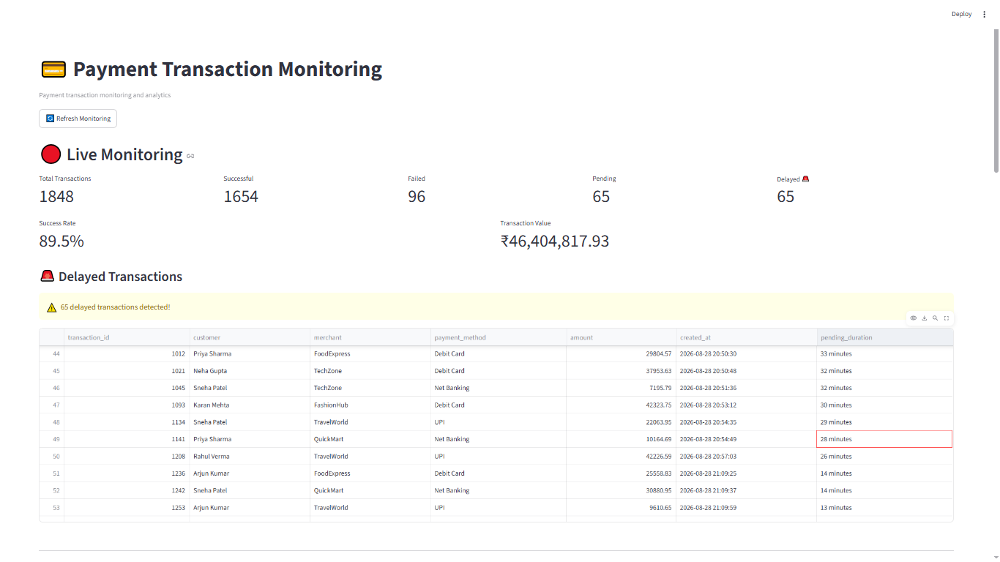
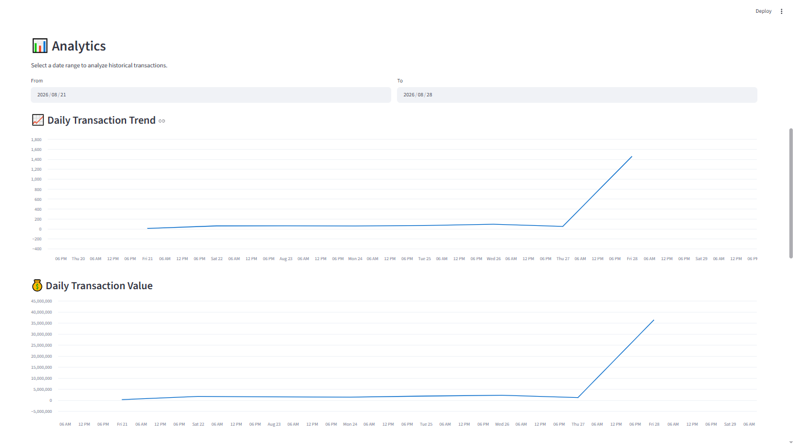
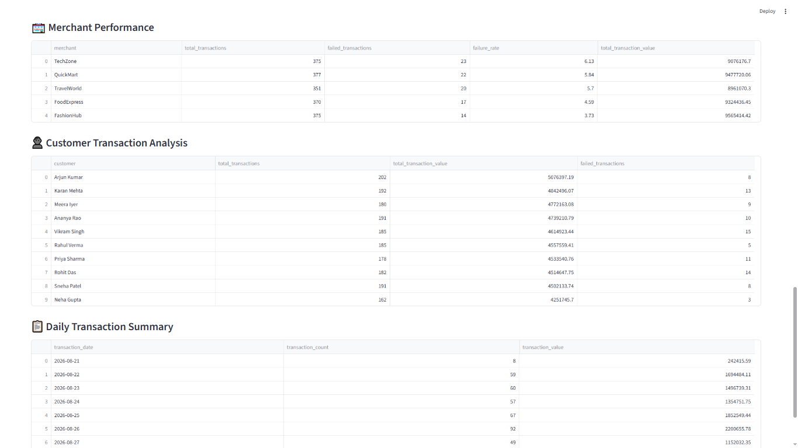

# 💳 Payment Transaction Monitoring

A data analytics and monitoring project built with Python, PostgreSQL, SQL, and Streamlit.

## 📌 Project Overview

This project monitors payment transactions and identifies delayed and failed transactions.

The system generates payment transaction data, stores it in PostgreSQL, analyzes the data using SQL, and displays the results through an interactive Streamlit dashboard.

## 🏗️ Architecture

Python
↓
Transaction Data Generation
↓
PostgreSQL
↓
SQL Analysis
↓
Streamlit Dashboard

## 🛠️ Technologies

- Python
- PostgreSQL
- SQL
- Pandas
- Streamlit
- psycopg2

## 📊 Dashboard Features

### Live Monitoring

- Total transactions
- Successful transactions
- Failed transactions
- Pending transactions
- Delayed transactions
- Success rate
- Total transaction value
- Delayed transaction alerts

### Analytics

- Daily transaction volume
- Daily transaction value
- Payment method failure rate
- Merchant performance
- Customer transaction analysis
- Date-range filtering

## 🚨 Delayed Transaction Rule

A transaction is considered delayed when:

- Status = `PENDING`
- Pending duration >= 10 seconds

```sql
NOW() - created_at >= INTERVAL '10 seconds'


### Live Payment Monitoring



### Payment & Transaction Analysis



### Customer & Merchant Analysis

